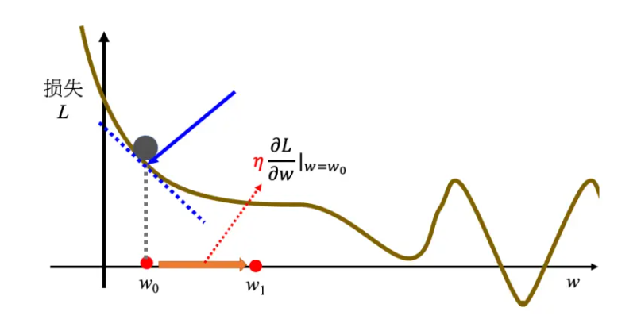

# DatawhaleAI夏令营笔记

## Task1

### 机器学习基础

#### 内涵

机器具备学习的能力，即让机器具备**找一个函数**的能力


#### 分类

##### 回归

通过函数输出一个数值

如预测未来某个时间的PM2.5


##### 分类

让机器做选择

如判断邮件是否为垃圾邮件


##### 结构化学习

产生一个有机构的物体

如让机器画一张画


#### 找函数的步骤

##### 写出一个带有未知参数的函数

如 `y = wx + b`

x: **Feature**

w: **weight**

b: **bias**


##### 定义损失

###### 损失函数

`L = L(b,w)`


###### 平均绝对误差（MAE)

```latex
e = |yˆ − y|
```


###### 均方误差（MSE）

```latex
e = (yˆ − y)2
```


##### 最优化

###### 梯度下降




假设这里有一个损失函数

L = L（w）

随机假设一个点w0，可以计算函数在该点处的微分

```latex
w1 ← w0 − η∂L/∂w|w=w0
```

从中可以发现斜率绝对值越大，移动的步伐越大，斜率为正向左移，为负向右移，不断迭代可以找到一个极值点，称为**局部最小值**，但不一定是**全局最小值**，这与w0有关


η：**学习率**

影响步伐大小，由自己设定，称为**超参数**

