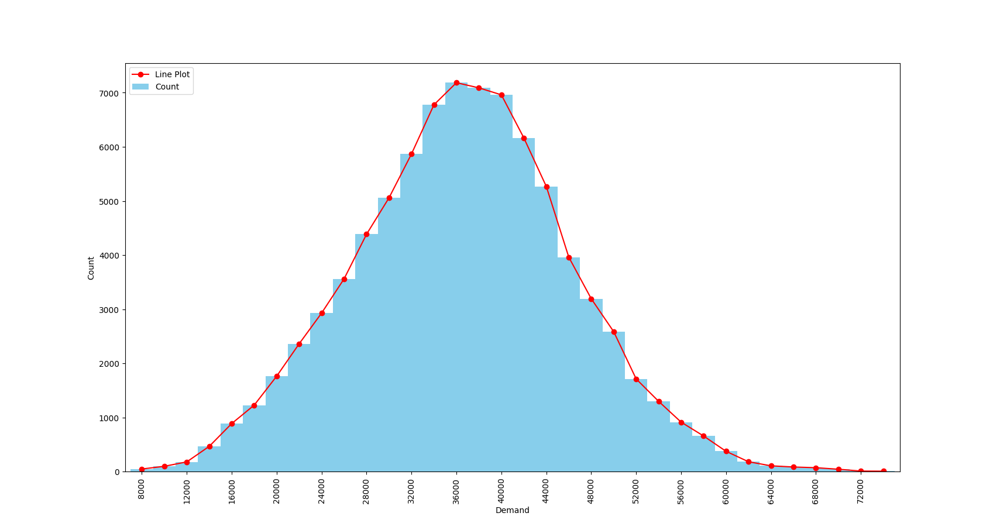
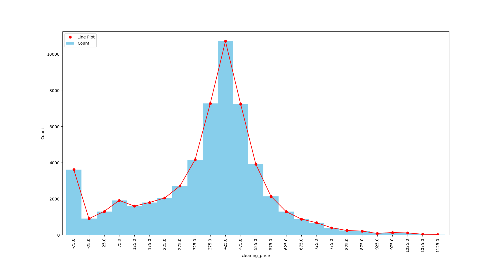
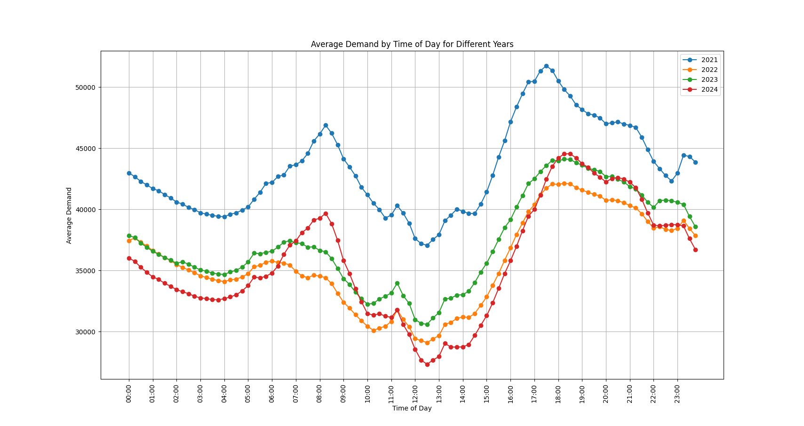
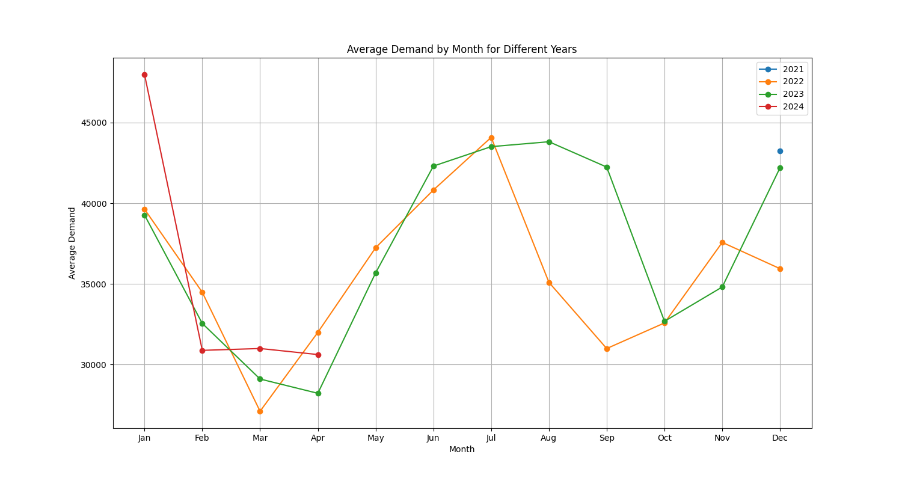
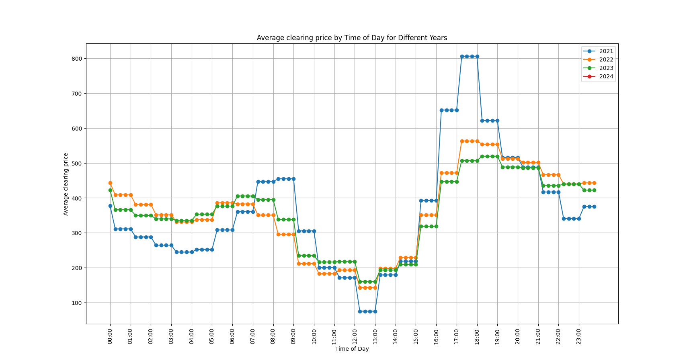
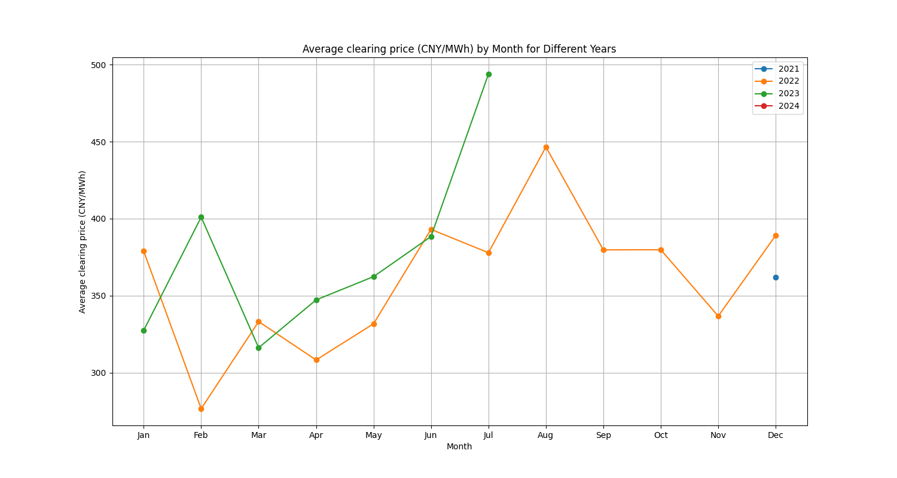
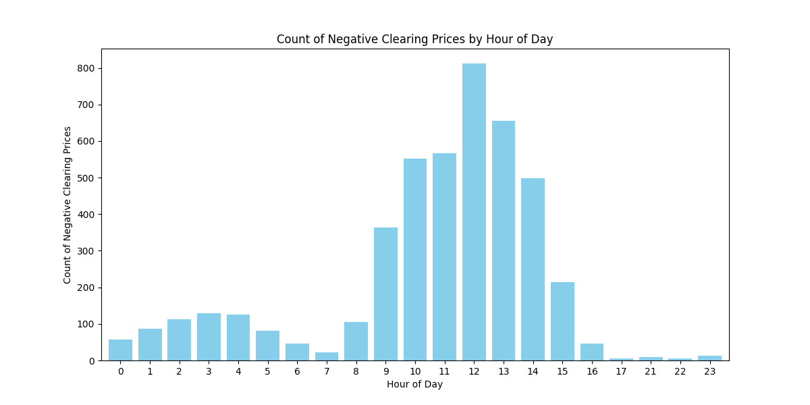
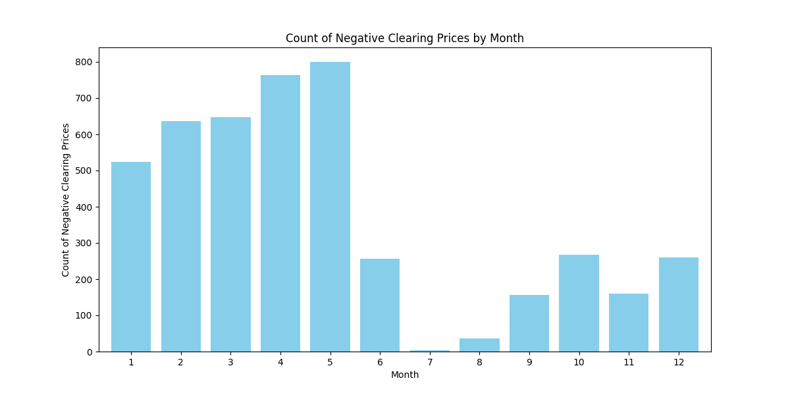
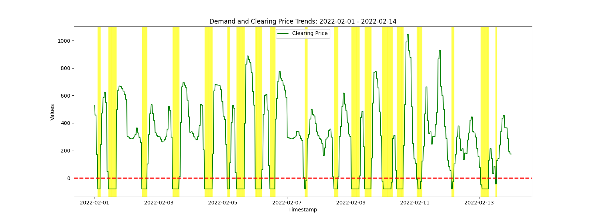
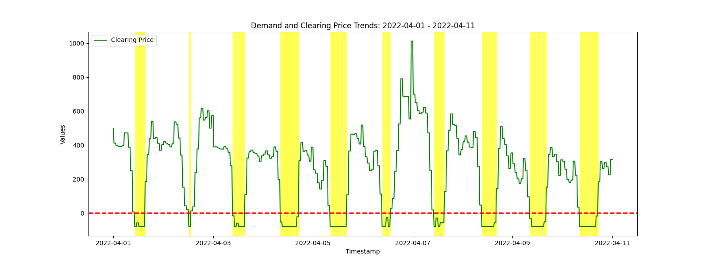

# DatawhaleAI夏令营笔记

## Intro

希望在task的指引下，从零开始建模，编写代码，并记录下自己的思路

库中含建模中用过的代码


## Task1

### 问题分析

#### 市场出清机制

##### 基本内容

收集买家和卖家的报价信息并排序，从最高买价和最低卖价进行匹配，直至到达**平衡**

##### 目的

确定交易物品的**价格**和**数量**

##### 名词解释

**市场出清价格：** 平衡点对应的价格


#### 任务

- 期待使用**Agent-based model**预测未来的市场出清价格


#### 数据集分析

| 变量名                        | 含义                                                   |
| ----------------------------- | ------------------------------------------------------ |
| demand                        | 需电量（兆瓦）                                         |
| clearing price (CNY/MWh)      | 市场出清价格(元/兆瓦时)                                |
| unit ID                       | 构造出的发电机组的ID                                   |
| Capacity(MW)                  | 装机容量                                               |
| utilization hour (h)          | 电厂的年平均运行小时数                                 |
| coal consumption (g coal/KWh) | 供电煤耗                                               |
| power consumption rate (%)    | 发电厂的利用率，指电厂单位时间内耗电量与发电量的百分比 |


#### 评价指标

```
c=（MSE+RMSE）/2
```


#### 提交格式

```Plain
submit.csv/submit.xlsx
day,time,clearing price （CNY/MWh）
2024/4/1 , 0:15 , 352.3340 
2024/4/1 , 0:30 , 355.5360
```


### 魔搭的基本使用

- [魔搭链接](https://modelscope.cn/my/mynotebook/preset)
- 启动Notebook
- 导入并运行代码


## Task2

### EDA

#### 含义

**探索性数据分析**，构造**强特征**

#### 基础统计指标

- 数据的集聚趋势
  - 均值：`df[feature].mean()`
  - 中位数 `df[feature].median()`
  - 最大值 `df[feature].max()`
  - 最小值 `df[feature].min()`
  - 众数 `df[feature].mode()`
- 数据的变异程度
  - 标准差 `df[feature].std()`
  - 极差 `df[feature].apply(lambda x: x.max() - x.min())`
  - 四分位数 `df[feature].quantile([0.25, 0.5, 0.75])`
  - 变异系数 `df[feature].std()/df[feature].mean()`
  - 偏度和峰度 `df[feature].skew()`, `df[feature].kurtosis()`


分析数据时，可以先从整体观察分析（绘制变化曲线），观察是否有异常点，异常点通常是解决问题的关键，以便进一步分析。

编写代码并绘制图像发现：



上图为各个需电量区间对应的数量，发现基本符合正态分布




上图为各个出清价格区间对应的数量，发现存在负的出清价格，并具有较高的比例，除了该部分基本符合正态分布

为什么会存在负出清价格？	————	①


#### 分时统计指标



(2021-2024一天各时段的平均需电量)

近三年需电量明显低于2021年，为什么？	————	②

图像大致呈M形	————	③




(2021-2024各月份的平均需电量)

图像大致呈W形	————	④




（2021-2023一天各时段的平均出清价格)

图像大致呈M形	————	⑤

21年低谷时更低，高峰时更高，22、23年数据相近	————	⑥




（2021-2023各月份的平均出清价格)

图像大致呈倒V形	————	⑦


### 数据分析

①负出清价格

- 什么时候出现负出清价格？

  

  晚上时在凌晨三点，白天时中午十二点左右常出现负出清价格

  

  

  一年中在夏秋季节出现较少，春冬季节较多

- 为什么会出现负出清价格？

  可能的原因：

  **电力供应过剩**：在某些情况下，特别是低需求时段（如深夜或某些季节），电力供应可能远远超过需求。可再生能源（如风能和太阳能）的不可预测性以及基载发电站（如核电和煤电）的非灵活性可能导致电力供应过剩。这时，电力供应商可能愿意以负价格出售电力，以避免停机或因为技术原因而继续运行。

  白天时负出清价格明显多于晚上，夏秋季节明显多于春冬，可能是采用光能发电缘故

  需电量与负出清价格出现次数在各时段的变化趋势大致相反，可能因为需电量大导致竞争激烈，从而降低出清价格

  

  **可再生能源补贴**：在许多地区，可再生能源发电商（如风能和太阳能）会收到政府补贴或激励，即使电价为负，他们仍能通过这些补贴获利。因此，他们有动力以负价格出售电力。

  

  **负荷跟踪和灵活性**：一些发电站（如核电站和某些煤电站）由于技术或经济原因无法灵活地调整输出，因此在电力过剩时段宁愿以负价格销售电力也不愿停机，因为停机和重新启动的成本可能更高。

  

  **假期**

  *2022-02-01  -  2022-02-14 春节、元宵*

  

  

  *2022-04-01  -  2022-04-11 清明*

  

  

  

  

  

  清明
  2022-04-01
  2022-04-02
  2022-04-03
  2022-04-04
  2022-04-05
  2022-04-06
  2022-04-07
  2022-04-08
  2022-04-09
  2022-04-10
  2022-04-11

  

  五一

  2022-05-01
  2022-05-02
  2022-05-03
  2022-05-04
  2022-05-05
  2022-05-06
  2022-05-07

  

  中秋

  2022-09-10
  2022-09-11

  

  国庆

  2022-10-04
  2022-10-07
  2022-10-08
  2022-10-09
  2022-10-10
  2022-10-11
  2022-10-12

  

  春节
  2023-01-18
  2023-01-19
  2023-01-20
  2023-01-21
  2023-01-22
  2023-01-23
  2023-01-24
  2023-01-25
  2023-01-27
  2023-01-28
  2023-01-29
  2023-01-30
  2023-02-01
  2023-02-05

  

  清明

  2023-04-02
  2023-04-05
  2023-04-08
  2023-04-09
  2023-04-10
  2023-04-11

  

  五一

  2023-04-27
  2023-04-29
  2023-04-30
  2023-05-01
  2023-05-02
  2023-05-06
  2023-05-07
  2023-05-08
