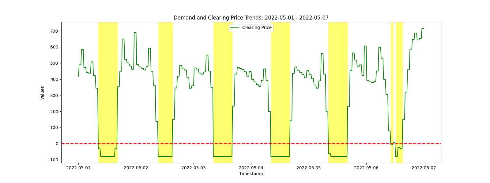
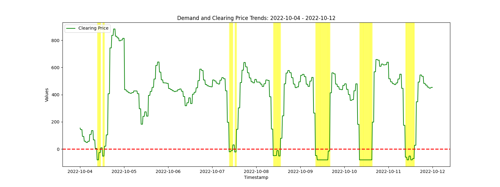
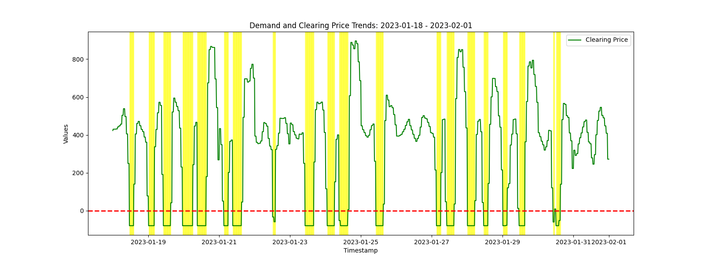
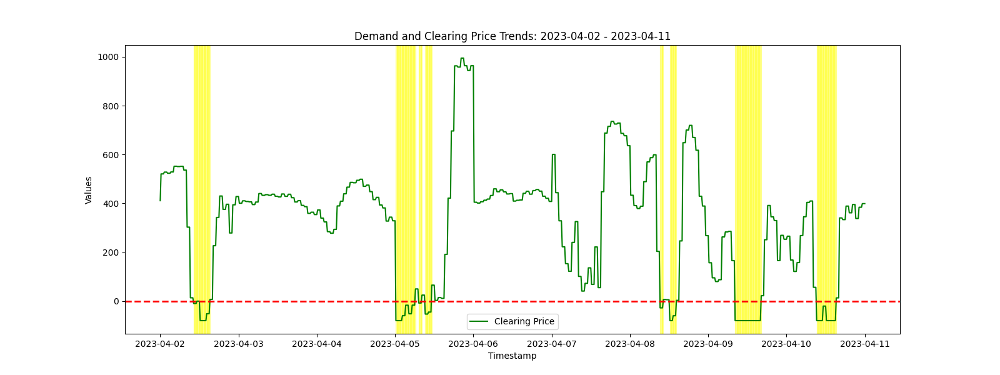
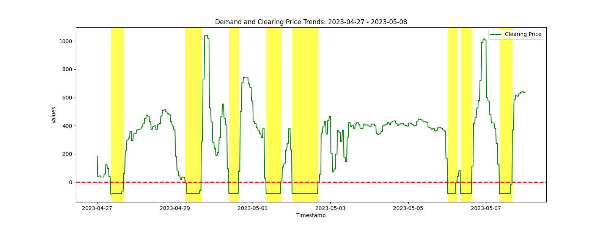
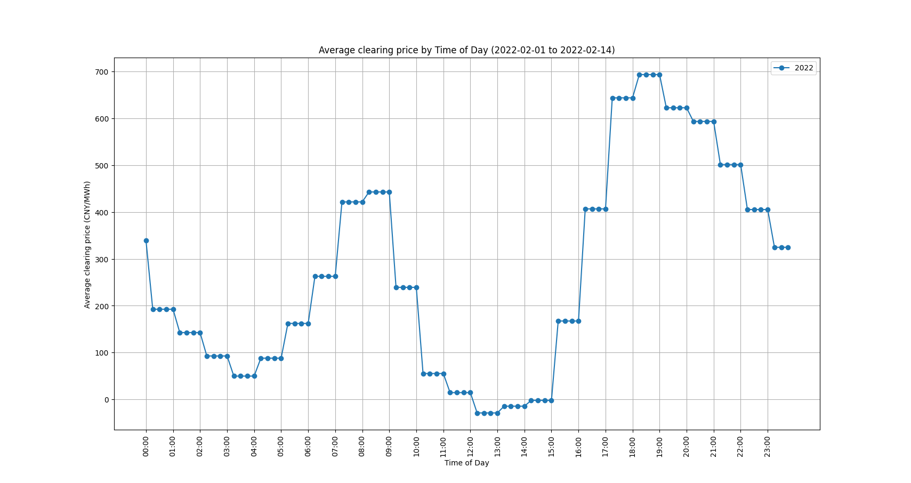
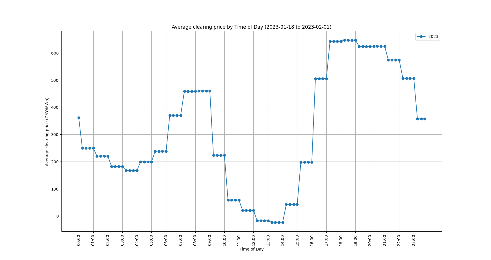

# DatawhaleAI夏令营笔记

## Intro

希望在task的指引下，从零开始建模，编写代码，并记录下自己的思路

库中含建模中用过的代码


## Task1

### 问题分析

#### 市场出清机制

##### 基本内容

收集买家和卖家的报价信息并排序，从最高买价和最低卖价进行匹配，直至到达**平衡**

##### 目的

确定交易物品的**价格**和**数量**

##### 名词解释

**市场出清价格：** 平衡点对应的价格


#### 任务

- 期待使用**Agent-based model**预测未来的市场出清价格


#### 数据集分析

| 变量名                        | 含义                                                   |
| ----------------------------- | ------------------------------------------------------ |
| demand                        | 需电量（兆瓦）                                         |
| clearing price (CNY/MWh)      | 市场出清价格(元/兆瓦时)                                |
| unit ID                       | 构造出的发电机组的ID                                   |
| Capacity(MW)                  | 装机容量                                               |
| utilization hour (h)          | 电厂的年平均运行小时数                                 |
| coal consumption (g coal/KWh) | 供电煤耗                                               |
| power consumption rate (%)    | 发电厂的利用率，指电厂单位时间内耗电量与发电量的百分比 |


#### 评价指标

```
c=（MSE+RMSE）/2
```


#### 提交格式

```Plain
submit.csv/submit.xlsx
day,time,clearing price （CNY/MWh）
2024/4/1 , 0:15 , 352.3340 
2024/4/1 , 0:30 , 355.5360
```


### 魔搭的基本使用

- [魔搭链接](https://modelscope.cn/my/mynotebook/preset)
- 启动Notebook
- 导入并运行代码


## Task2

### EDA

#### 含义

**探索性数据分析**，构造**强特征**

#### 基础统计指标

- 数据的集聚趋势
  - 均值：`df[feature].mean()`
  - 中位数 `df[feature].median()`
  - 最大值 `df[feature].max()`
  - 最小值 `df[feature].min()`
  - 众数 `df[feature].mode()`
- 数据的变异程度
  - 标准差 `df[feature].std()`
  - 极差 `df[feature].apply(lambda x: x.max() - x.min())`
  - 四分位数 `df[feature].quantile([0.25, 0.5, 0.75])`
  - 变异系数 `df[feature].std()/df[feature].mean()`
  - 偏度和峰度 `df[feature].skew()`, `df[feature].kurtosis()`


分析数据时，可以先从整体观察分析（绘制变化曲线），观察是否有异常点，异常点通常是解决问题的关键，以便进一步分析。

编写代码并绘制图像发现：


上图为各个需电量区间对应的数量，发现基本符合正态分布


上图为各个出清价格区间对应的数量，发现存在负的出清价格，并具有较高的比例，除了该部分基本符合正态分布

为什么会存在负出清价格？	————	①


#### 分时统计指标


(2021-2024一天各时段的平均需电量)

近三年需电量明显低于2021年，为什么？	————	②

图像大致呈M形	————	③


(2021-2024各月份的平均需电量)

图像大致呈W形	————	④


（2021-2023一天各时段的平均出清价格)

图像大致呈M形	————	⑤

21年低谷时更低，高峰时更高，22、23年数据相近	————	⑥


（2021-2023各月份的平均出清价格)

图像大致呈倒V形	————	⑦


### 数据分析

#### ①负出清价格

- 什么时候出现负出清价格？

  

  晚上时在凌晨三点，白天时中午十二点左右常出现负出清价格

  

  

  一年中在夏秋季节出现较少，春冬季节较多

- 为什么会出现负出清价格？

  可能的原因：

  **电力供应过剩**：在某些情况下，特别是低需求时段（如深夜或某些季节），电力供应可能远远超过需求。可再生能源（如风能和太阳能）的不可预测性以及基载发电站（如核电和煤电）的非灵活性可能导致电力供应过剩。这时，电力供应商可能愿意以负价格出售电力，以避免停机或因为技术原因而继续运行。

  白天时负出清价格明显多于晚上，夏秋季节明显多于春冬，可能是采用光能发电缘故

  需电量与负出清价格出现次数在各时段的变化趋势大致相反，可能因为需电量大导致竞争激烈，从而降低出清价格

  

  **可再生能源补贴**：在许多地区，可再生能源发电商（如风能和太阳能）会收到政府补贴或激励，即使电价为负，他们仍能通过这些补贴获利。因此，他们有动力以负价格出售电力。

  

  **负荷跟踪和灵活性**：一些发电站（如核电站和某些煤电站）由于技术或经济原因无法灵活地调整输出，因此在电力过剩时段宁愿以负价格销售电力也不愿停机，因为停机和重新启动的成本可能更高。

  

  **假期**

  *2022-02-01  -  2022-02-14 春节、元宵*

  

  

  *2022-04-01  -  2022-04-11 清明*

  

  

  *2022-05-01 - 2022-05-07 五一*

  

  

  *2022-10-04 - 2022-10-12 国庆*

  

  

  *2023-01-18 - 2023-02-01 春节*  

  

  

  *2023-04-02 - 2023-04-11 清明*

  

  

  *2023-04-27 - 2023-05-08 五一*

  

  

  假期的效应在春节、五一比较显著

  原因可能是：

  - 员工放假，从而导致火力发电量下降
  - 需电量增大

  

  具体分析春节各时段的平均出清价格

  

  

  晚上时在凌晨三点，白天时中午十二点出清价格最低，与前文分析一致

  

  

#### ②近三年需电量明显低于2021年

可能是**光伏发电**的兴起，对传统火力发电的影响


#### ③2021-2024一天各时段的平均需电量呈M形

- 早高峰：一般在6-9点
- 晚高峰：一般在16-21点
- 低谷期：10-15点

*鸭子曲线：由于火电和光伏发电互为替代品，当一天太阳出来后，太阳能逐渐开始替代火电，并在14点达到最大，进而导致火电受光伏发电竞争而降价。而在傍晚时太阳落山，光伏机组迅速减小发电，此时火电开始集中发电，价格迅速上升，形成了一天中典型的“两高峰，一低谷”的态势。*


#### ④2021-2024各月份的平均需电量呈W形

- 高峰：一月、七月
- 低谷期：三月、十月

一月份天气寒冷，可能对暖气等需求量大，七月份天气炎热，对制冷需求量大，需电量高


#### ⑤2021-2023一天各时段的平均出清价格呈M形

需电量与出清价格呈正相关


#### ⑥2021-2023一天各时段的平均出清价格，21年低谷时更低，高峰时更高，22、23年数据相近

- 22、23年光伏发电发展，24年的平均出清价格可能小于等于该值
- 因为21年整体需求量高于22、23年，高峰时需求量更高，出清价格更高，低谷时竞争更大，出清价格更低

（我可不可以认为 出清价格由正出清价格和负出清价格构成 ？）


#### ⑦2021-2023各月份的平均出清价格图像大致呈倒V形

由上面分析可知，需电量与出清价格呈正相关，因此各月份的平均出清价格图像大致呈倒V形


### 小结

影响出清价格因素

- 时段
- 季节
- 假期
- 需电量

相关性

- 出清价格与需电量呈正比
- 负出清价格与需电量呈反比


### ABM

#### 构建环境

##### 交互地图

~~离散方格、连续方格、网络、甚至是下载的RPG地图……~~ 这里没有设置地图。

##### 数据收集器

主要用于记录实验中的一些数据，例如每个Agent的某个属性；也可以传入一个函数，接受Agent/Model进行某种处理来获取数据。

##### 智能体调度器

描述以何种顺序触发智能体的行为。

#### 构建智能体

##### 智能体ID

##### 智能体之间交互规则

##### 智能体与环境交互规则

##### 智能体的其他行为


## Task3

### LightGBM + Linear

#### 特征工程

由Task2的EDA分析，这里提取了如下特征

```python
# 提取时间索引的小时信息，并添加到训练数据中，创建 "hour" 列
train_data["hour"] = electricity_price.index.hour

# 提取时间索引的日期信息，并添加到训练数据中，创建 "day" 列
train_data["day"] = electricity_price.index.day

# 提取时间索引的月份信息，并添加到训练数据中，创建 "month" 列
train_data["month"] = electricity_price.index.month

# 提取时间索引的年份信息，并添加到训练数据中，创建 "year" 列
train_data["year"] = electricity_price.index.year

# 提取时间索引的星期信息，并添加到训练数据中，创建 "weekday" 列
train_data["weekday"] = electricity_price.index.weekday

# 根据月份信息，判断是否为风季（1-5月和9-12月），创建布尔型 "is_windy_season" 列
train_data["is_windy_season"] = electricity_price.index.month.isin([1, 2, 3, 4, 5, 9, 10, 11, 12])

# 根据小时信息，判断是否为低谷时段（10-15点），创建布尔型 "is_valley" 列
train_data["is_valley"] = electricity_price.index.hour.isin([3, 4, 5, 10, 11, 12, 13, 14, 15])

# 提取时间索引的季度信息，并添加到训练数据中，创建 "quarter" 列
train_data["quarter"] = electricity_price.index.quarter

# 判断训练数据的索引是否在春节日期列表中，生成布尔型列 "is_spring_festival"
train_data["is_spring_festival"] = train_data.index.isin(spring_festivals)

# 判断训练数据的索引是否在劳动节日期列表中，生成布尔型列 "is_labor"
train_data["is_labor"] = train_data.index.isin(labor)

# 判断训练数据的索引是否在清明节日期列表中，生成布尔型列 "is_labor"
train_data["is_qingming"] = train_data.index.isin(qingming)
```


#### 模型训练

通过LightGBM和Linear模型，并加权得到预测值

（通过多次提交，发现线性回归模型的效果会更好点）

```python
# 简单求均值
y_pred = lgb_pred * 0.3 + linear_pred*0.7
y_pred *= 0.95  # 进行少量修正
sample_submit["clearing price (CNY/MWh)"] = y_pred
sample_submit.to_csv("submit.csv", index=False)
```


### ABM报价策略优化

#### 报价机制

分段报价

#### 报价策略

| 负荷程度 | 弹性程度 | 报价策略     |
| -------- | -------- | ------------ |
| 低       | 高       |              |
| 中       | 低       | 边际成本报价 |
| 高       | 高       | 风险报价     |


我的思路

构建环境

- demand为当天的demand
- demand仍大于0时，对参与竞争但还未成功的agent，从最低报价的agent开始，认定该agent竞争成功，直至demand小于0
- demand小于0后，记录最后一次报价对应的actual

定义agent行为

- 是否竞争

- 是否竞争成功

- 初始报价为表中的actual cost

- 当剩余demand大于500时，且还未参与竞争，报价最低，则参与竞争并竞争成功，环境的demand减少该agent的capacity

- 当剩余demand小于500时，且还未参与竞争，若该agent的capacity超过剩余的demand，降低报价，参与竞争

- 当剩余demand小于500时，且还未参与竞争，若该agent的capacity未超过剩余的demand，参与竞争，但未降低报价

- 2至5，10至15时，降低报价

- 1, 2, 3, 4, 5, 9, 10, 11, 12月，降低报价

- 春节，清明节，五一，降低报价，且降低更多

  （降价效果要叠加）

对于环境和agent的定义见代码

目前拟合程度还不是很好

训练发现，预测值会出现连续大量相同的出清价格，可能是demand接近，环境和agent的定义不够完善，效果明显不如直接通过demand预测


## 学习感想

从魔搭的第一次使用，到baseline的第一次跑通；从12939，再到11302；从美赛建模的摸爬滚打，再到Datawhale的初体验。通过这次夏令营，让我更深入理解了数学建模过程中的细节，或是数据的深度挖掘、特征工程的处理，或是ABM模型的构建，都令我茅塞顿开，豁然开朗。希望在接下来的时间不再停留在漫长的调参，而是能够坚持探索，继续强化学习，深度学习。


